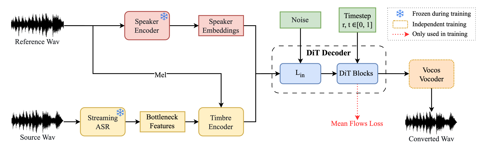

# MeanVC: Lightweight and Streaming Zero-Shot Voice Conversion via Mean Flows

<div align="center">

[](https://arxiv.org/pdf/2510.08392)
[](https://huggingface.co/ASLP-lab/MeanVC)
[](https://aslp-lab.github.io/MeanVC/)

</div>

**MeanVC** is a lightweight and streaming zero-shot voice conversion system that enables real-time timbre transfer from any source speaker to any target speaker while preserving linguistic content. The system introduces a diffusion transformer with chunk-wise autoregressive denoising strategy and mean flows for efficient single-step inference.



## ✨ Key Features

-   **🚀 Streaming Inference**: Real-time voice conversion with chunk-wise processing.
-   **⚡ Single-Step Generation**: Direct mapping from start to endpoint via mean flows for fast generation.
-   **🎯 Zero-Shot Capability**: Convert to any unseen target speaker without re-training.
-   **💾 Lightweight**: Significantly fewer parameters than existing methods.
-   **🔊 High Fidelity**: Superior speech quality and speaker similarity.

## 🚀 Getting Started

### 1. Environment Setup

Follow the steps below to clone the repository and install the required environment.

```bash
# Clone the repository and enter the directory
git clone https://github.com/ASLP-lab/MeanVC.git
cd MeanVC

# Create and activate a Conda environment
conda create -n meanvc python=3.11 -y
conda activate meanvc

# Install dependencies
pip install -r requirements.txt
```

### 2. Download Pre-trained Models

Run the provided script to automatically download all necessary pre-trained models.

```bash
python download_ckpt.py
```

This will download the main VC model, vocoder, and asr model into the `src/ckpt/` directories.

This will download the main VC model, vocoder, and asr model into the `src/ckpt/` directories.

The speaker verification model (`wavlm_large_finetune.pth`) must be downloaded manually from Google Drive.  Download the file from [this link](https://drive.google.com/file/d/1-aE1NfzpRCLxA4GUxX9ITI3F9LlbtEGP/view).  Place the downloaded `wavlm_large_finetune.pth` file into the `src/runtime/speaker_verification/ckpt/` directory.


### 3. Real-Time Voice Conversion

This script captures audio from your microphone and converts it in real-time to the voice of a target speaker.

```bash
python src/runtime/run_rt.py --target-path "path/to/target_voice.wav"
```

-   `--target-path`: Path to a clean audio file of the target speaker. This voice will be used as the conversion target. An example file is provided at `src/runtime/example/test.wav`.

When you run the script, you will be prompted to select your audio input (microphone) and output (speaker) devices from a list.

### 4. Offline Voice Conversion

For batch processing or converting pre-recorded audio files, use the offline conversion script.

```bash
bash scripts/infer_ref.sh
```

Before running the script, you need to configure the following paths in `scripts/infer_ref.sh`:

-   `source_path`: Path to the source audio file or directory containing multiple audio files to be converted
-   `reference_path`: Path to a clean audio file of the target speaker (used as voice reference)
-   `output_dir`: Directory where converted audio files will be saved (default: `src/outputs`)
-   `steps`: Number of denoising steps (default: 2)


## 🏋️‍♀️ Training

To train the model on your own dataset, follow these steps.

### 1. Data Preprocessing

First, you need to extract Mel spectrograms, content features (BN), and speaker embeddings from your audio data.

```bash
# 1. Extract Mel spectrograms (10ms frame shift)
python src/preprocess/extrace_mel_10ms.py --input_dir path/to/wavs --output_dir path/to/mels

# 2. Extract content features (160ms window)
python src/preprocess/extract_bn_160ms.py --input_dir path/to/wavs --output_dir path/to/bns

# 3. Extract speaker embeddings
python src/preprocess/extract_spk_emb_wavlm.py --input_dir path/to/wavs --output_dir path/to/xvectors
```

### 2. Prepare Data List

Create a file list (e.g., `train.list`) for training. Each line should follow this format:

```
# Format: utt|bn_path|mel_path|xvector_path|prompt_mel_path1|prompt_mel_path2|...
utterance_id_001|/path/to/bns/utt001.npy|/path/to/mels/utt001.npy|/path/to/xvectors/utt001.npy|/path/to/mels/prompt01.npy
```

### 3. Start Training

Modify the configurations in `script/train.sh` (e.g., data paths, model directory) and run the script.

```bash
bash script/train.sh
```

## 📋 TODO

-   [x] 🌐 **Demo website**
-   [x] 📝 **Paper release**
-   [x] 🤗 **HuggingFace model release**
-   [x] 🔓 **Release inference code**
-   [x] 🔓 **Release training code**
-   [ ] 📱 **Android deployment package**

## 📜 License & Disclaimer

MeanVC is released under the Apache License 2.0. This open-source license allows you to freely use, modify, and distribute the model, as long as you include the appropriate copyright notice and disclaimer.

MeanVC is designed for research and legitimate applications in voice conversion technology. Users must obtain proper consent from individuals whose voices are being converted or used as references. We strongly discourage any malicious use including impersonation, fraud, or creating misleading audio content. Users are solely responsible for ensuring their use cases comply with ethical standards and legal requirements.

## ❤️ Acknowledgments
Our work is built upon the following open-source projects [MeanFlow](https://github.com/haidog-yaqub/MeanFlow), [F5-TTS](https://github.com/SWivid/F5-TTS) and [Vocos](https://github.com/gemelo-ai/vocos). Thanks to the authors for their great work, and if you have any questions, you can first check them on their respective issues.


## 📄 Citation

If you find our work helpful, please cite our paper:

```bibtex
@article{ma2025meanvc,
  title={MeanVC: Lightweight and Streaming Zero-Shot Voice Conversion via Mean Flows},
  author={Ma, Guobin and Yao, Jixun and Ning, Ziqian and Jiang, Yuepeng and Xiong, Lingxin and Xie, Lei and Zhu, Pengcheng},
  journal={arXiv preprint arXiv:2510.08392},
  year={2025}
}
```

## 📧 Contact

If you are interested in leaving a message to our research team, feel free to email guobin.ma@mail.nwpu.edu.cn

You’re welcome to join our WeChat group for technical discussions, updates.


<p align="center">
    
</p>


<p align="center">
    
</p>

<p align="center">
    
</p>